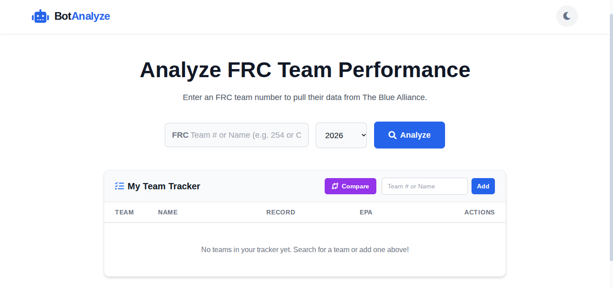
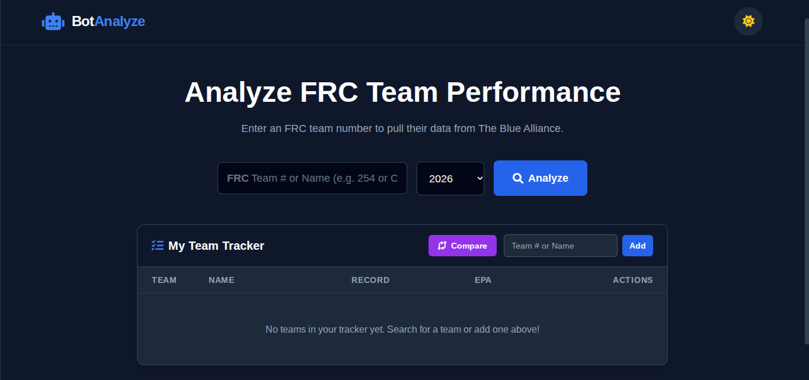
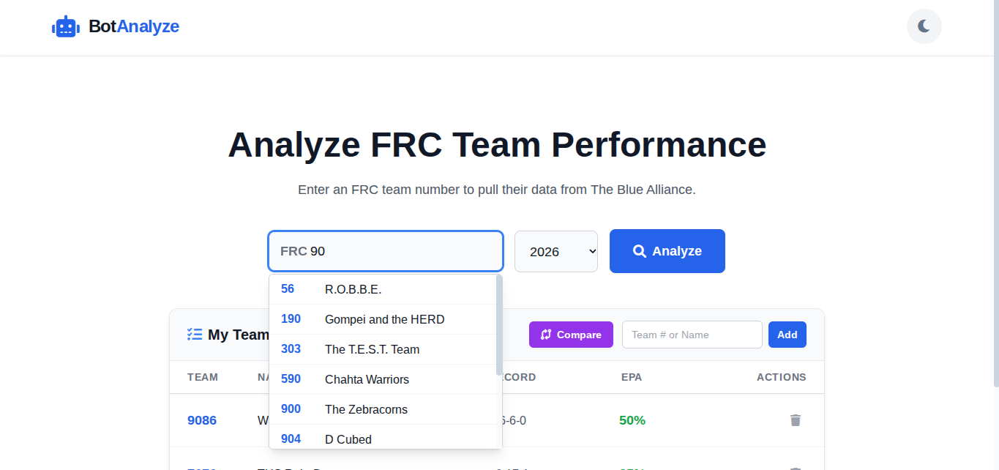
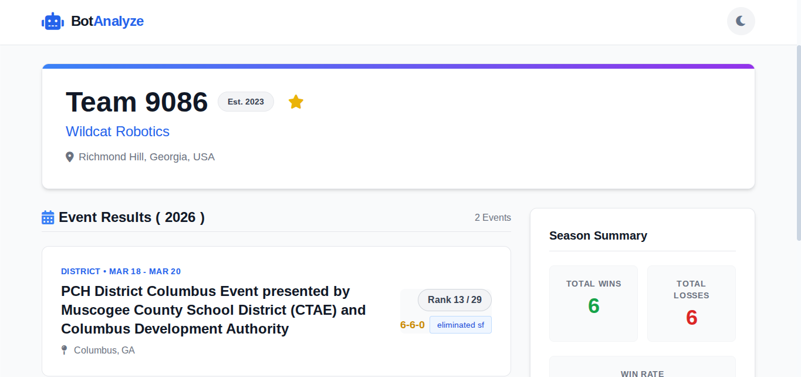
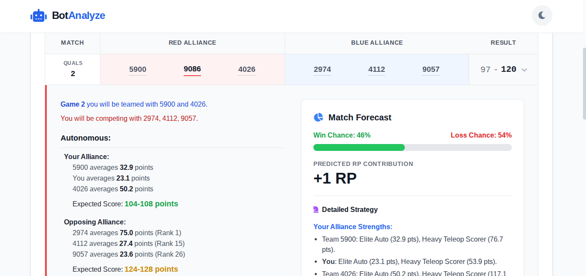
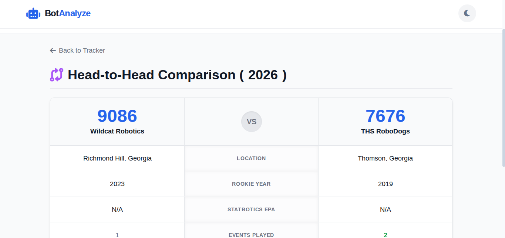

# BotAnalyze
An HTML app made to analyze FRC competition data and provide predictions and comparisons between teams.  
The full website can be found at [garrettpearson1.github.io/botanalyze](https://garrettpearson1.github.io/botanalyze). 

 
## Change-log
v1.0- Created Bot Analyze 
v1.1- Updated Team Homepage Layout 
v1.2- Added Dark and Light Mode 
v1.3- Added Game Overview 
v1.4- Added Advanced Strategy 
v1.5- Added Side-by-Side Comparison 
v1.6- Updated Search Bar 

## Future Updates
- Fix Team Search Selection 
- Fix Team Comparison Page Updater 
- Recalculate Team Analytics (Divide scores by 3 because each alliance has three teams.) 
